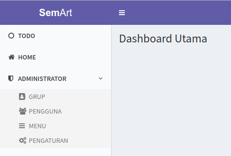
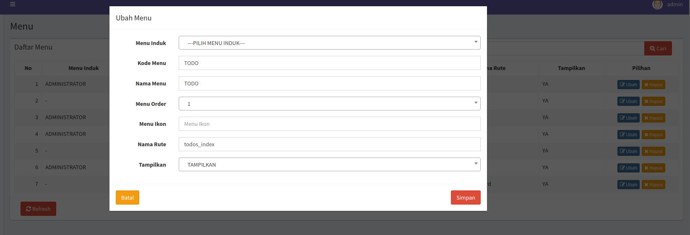

# Penggunaan Dasar

## Generate CRUD

- Buat entity baru, sebagai contoh `Todo`

```php
<?php

declare(strict_types=1);

namespace KejawenLab\Semart\Skeleton\Entity;

use Doctrine\ORM\Mapping as ORM;
use Gedmo\Blameable\Traits\BlameableEntity;
use Gedmo\Mapping\Annotation as Gedmo;
use Gedmo\SoftDeleteable\Traits\SoftDeleteableEntity;
use Gedmo\Timestampable\Traits\TimestampableEntity;
use KejawenLab\Semart\Skeleton\Contract\Entity\NameableTrait;
use KejawenLab\Semart\Skeleton\Contract\Entity\PrimaryableTrait;
use KejawenLab\Semart\Skeleton\Search\Searchable;
use KejawenLab\Semart\Skeleton\Sort\Sortable;
use Symfony\Bridge\Doctrine\Validator\Constraints\UniqueEntity;

/**
 * @ORM\Table(name="tbl_todo", indexes={@ORM\Index(name="tbl_todo_search_idx", columns={"nama"})})
 * @ORM\Entity(repositoryClass="KejawenLab\Semart\Skeleton\Repository\TodoRepository")
 *
 * @Gedmo\SoftDeleteable(fieldName="deletedAt")
 *
 * @Searchable({"name"})
 * @Sortable({"name"})
 *
 * @UniqueEntity(fields={"name"}, repositoryMethod="findUniqueBy", message="label.crud.non_unique_or_deleted")
 *
 * @author Muhamad Surya Iksanudin <surya.iksanudin@gmail.com>
 */
class Todo
{
    use BlameableEntity;
    use NameableTrait;
    use PrimaryableTrait;
    use SoftDeleteableEntity;
    use TimestampableEntity;
}

```

- Buat repository class-nya, dalam kasus ini class `TodoRepository`

```php
<?php

declare(strict_types=1);

namespace KejawenLab\Semart\Skeleton\Repository;

use Doctrine\Common\Persistence\ManagerRegistry;
use KejawenLab\Semart\Skeleton\Entity\Todo;

/**
 * @author Muhamad Surya Iksanudin <surya.iksanudin@gmail.com>
 */
class TodoRepository extends Repository
{
    public function __construct(ManagerRegistry $registry)
    {
        parent::__construct($registry, Todo::class);
    }
}

```

- Jalankan perintah `php bin/console doctrine:schema:update --force`

- Jalankan perintah `php bin/console semart:generate "KejawenLab\Semart\Skeleton\Entity\Todo"`

- Ubah translasi pada file `translations/messages.id.yaml` dan tambahkan 

```yaml
label:
    # Hide others translation
    todo:
        name: 'Nama'
```

- Yeeeaaaahhhhhh!!! CRUD Anda sudah jadi!!!

## Ubah Menu

Secara default, CRUD yang dibuat di atas terdaftar pada root menu sebagai berikut:

 
 
 Untuk mengubahnya, kita masuk ke menu **Menu** lalu klik tombol **Ubah** pada menu `Todo`, dan Anda dapat mengubah menu induk, icon, dan sebagainya seperti pada gambar berikut:
 
 

## Ubah Template

Secara default, template yang di-generate ada 3 yaitu `todo/index.html.twig`, `todo/pagination.html.twig` dan `todo/table-content.html.twig` dengan fungsi sebagai berikut:

- `todo/index.html.twig`

> Ini adalah template utama, berisi form dan list dari `Todo`

- `todo/pagination.html.twig`

> Berisi definisi dari pagination

- `todo/table-content.html.twig`

> Berisi definisi dari list tabel


Secara default, setiap form dan list tabel berisi 2 fields yaitu `code` dan `name` sehingga kita perlu mengubah form dan list tabel untuk disesuaikan dengan entity `Todo` yang hanya punya `name`.
Caranya buka file `todo/index.html.twig` dan hapus baris kode berikut:

```html
<th class="text-center">{{ 'label.todo.code' | trans }} <i data-sort="no" data-sort-field="code" class="fa fa-sort sortable pull-right"></i></th>
```

dan 

```html
<div class="form-group">
    <label for="username" class="col-sm-2 control-label">{{ 'label.todo.code' | trans }}</label>
    <div class="col-sm-10">
        <input type="text" class="form-control" id="code" placeholder="{{ 'label.todo.code' | trans }}">
    </div>
</div>
```

serta memperbarui Ajax handler berikut:

```javascript
$(document).on('click', '.save', function () {
    let id = $('#id').val();
    let code = $('#code').val();
    let name = $('#name').val();

    $.post(Routing.generate('todos_save'), {
        _csrf_token: localStorage.getItem('csrf_token'),
        id: id,
        code: code,
        name: name
    }, function (response) {
        if ('OK' === response.status) {
            localStorage.setItem('csrf_token', response._csrf_token);

            $('#form-modal').modal('hide');

            toastr['success']('{{ 'label.crud.save_message' | trans }}');

            refreshTable(Routing.generate('todos_index'), '{{ title }}');
        } else {
            localStorage.setItem('csrf_token', response._csrf_token);

            let listError = '<ul>';
            $.each(response.errors, function (key, value) {
                listError = listError + '<li>' + value + '</li>';
            });
            listError = listError + '</ul>';

            $('.error-body').html(listError);
            $('.error-modal').modal();
        }
    });
});

$(document).on('shown.bs.modal', '#form-modal', function (e) {
    let relatedTarget = e.relatedTarget;
    let id = $(relatedTarget).data('primary');
    let container = $('body');

    container.semartLoader();

    if ('undefined' !== typeof id) {
        $.get(Routing.generate('todos_detail', {id: id}), function (response) {
            let data = JSON.parse(response);
            $('#id').val(data.id);
            $('#code').val(data.code);
            $('#name').val(data.name);

            $('.form-title').html('{{ 'label.crud.edit_title' | trans({'%title%': title }) }}');

            container.trigger('destroy.semart.loader');
        });
    } else {
        container.trigger('destroy.semart.loader');
    }
});
```

dengan menghapus semua kode yang berkaitan dengan `code` yaitu:

```
//Baris
let code = $('#code').val();

//Baris
code: code,

//Baris 
$('#code').val(data.code);
```


Selanjutnya Anda harus mengubah file `todo/table-content.html.twig` dan menghapus baris kode berikut:

```html
<td>{{ data.code }}</td>
```

Sehingga tamplete kita hanya memiliki field `name` saja baik pada form maupun list tabel. Sehingga hasilnya adalah sebagai berikut:


 
Selamat!!! Menu `Todo` kita sudah dapat diakses dan jalan 100% 
